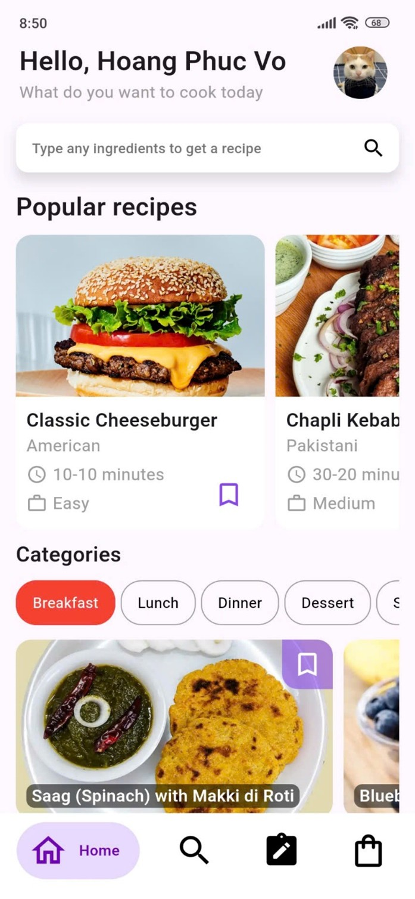

# Meals Manager 🍳

Discover your favorite recipes, save your top picks, and create your personalized shopping list—all in one place! Food Recipe App is your ultimate cooking companion, designed for convenience and tailored to your taste.

## Features 🌟

* **Explore Recipes:** Browse a wide range of recipes and cooking ideas tailored to your preferences
* **Save Favorites:** Bookmark your favorite recipes for easy access anytime
* **Shopping List:** Automatically generate a list of ingredients needed for your selected recipes
* **Firebase Integration:** Securely save your favorite recipes in the cloud using Google authentication
* **Responsive Design:** Optimized for all mobile devices, ensuring a seamless experience across screen sizes

## Getting Started 🚀

This project is a starting point for a Flutter application.

A few resources to get you started if this is your first Flutter project:

- [Lab: Write your first Flutter app](https://docs.flutter.dev/get-started/codelab)
- [Cookbook: Useful Flutter samples](https://docs.flutter.dev/cookbook)

For help getting started with Flutter development, view the
[online documentation](https://docs.flutter.dev/), which offers tutorials,
samples, guidance on mobile development, and a full API reference.

## Screenshots 📸

### Login Screen


### Home Screen


### Detail Screen


### Search Screen


### Favorites Screen


### Ingredients Screen


## Installation 🛠️

1. Clone the repository:
```bash
git clone https://github.com/yourusername/meals-manager.git
```

2. Navigate to the project directory:
```bash
cd meals-manager
```

3. Install dependencies:
```bash
flutter pub get
```

4. Run the app:
```bash
flutter run
```

## Technologies Used 💻

- **Frontend:** Flutter
- **State Management:** Provider
- **Backend:** Firebase
- **Authentication:** Firebase Auth
- **Database:** Cloud Firestore

## Contact 📧

For questions or suggestions, feel free to reach out:
* **Email:** Phuc111239@gmail.com
* **GitHub:** [Your GitHub Profile]([https://github.com/yourusername](https://github.com/PhucVo-work))
